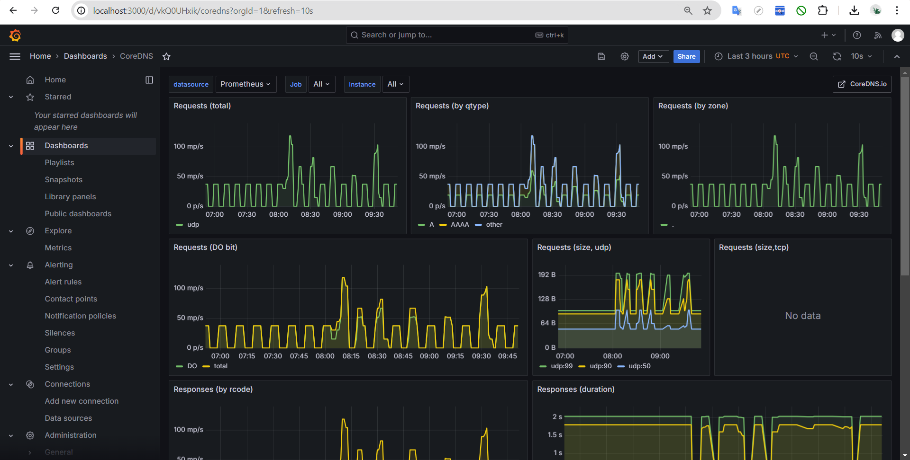
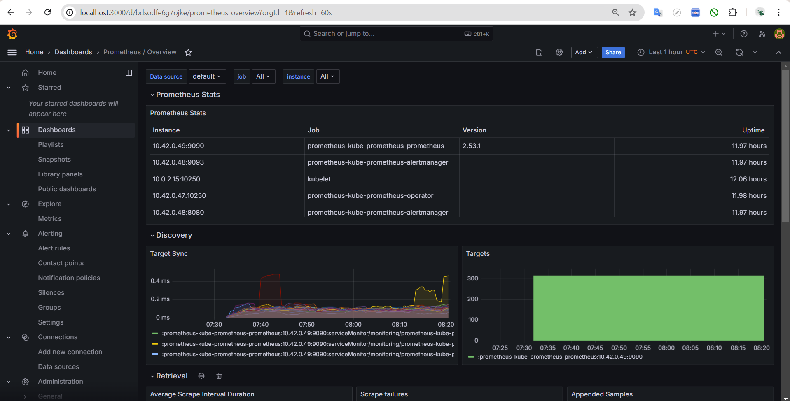
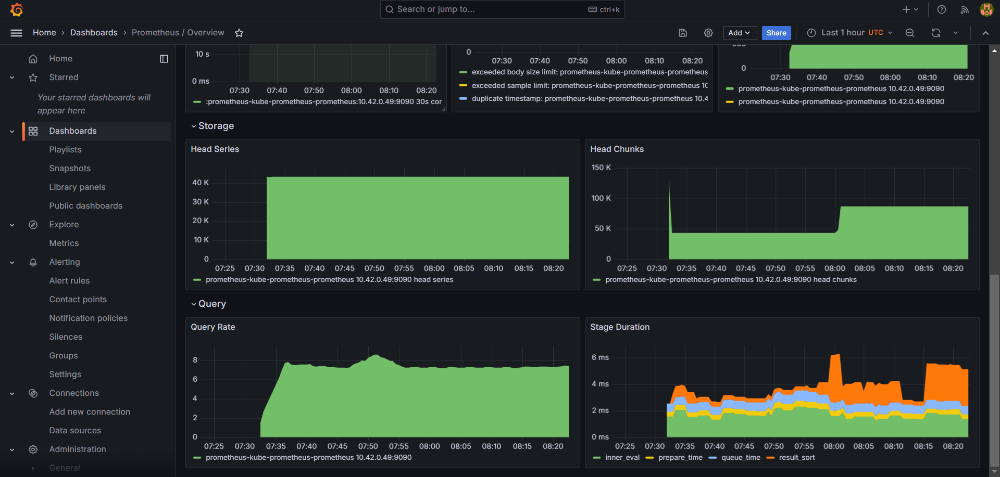
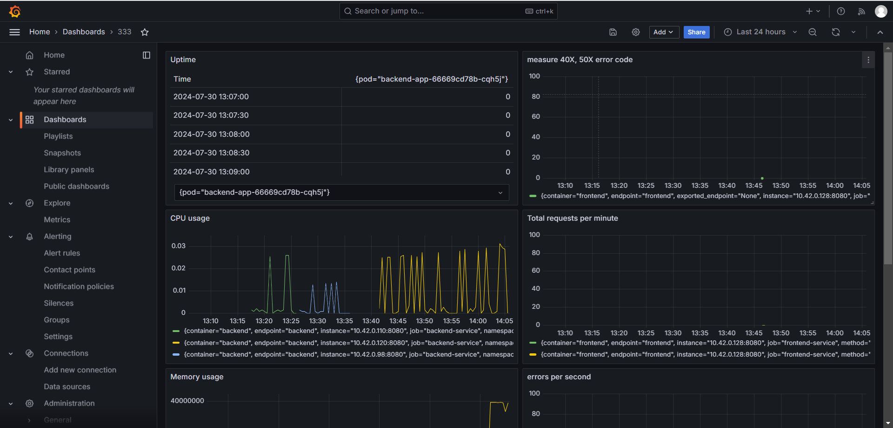
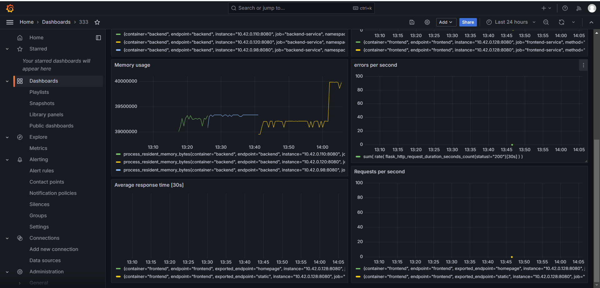

# Building a Metrics dashboard

## Overview

In this project, we will create dashboards that use multiple graphs to monitor our sample application that is deployed on a Kubernetes cluster. We will be using [Prometheus](https://prometheus.io/), [Jaeger](https://www.jaegertracing.io/), and [Grafana](https://grafana.com/) in order to monitor, trace and visualize your experience.

## Verify the monitoring installation

_TODO:_ run `kubectl` command to show the running pods and services for all components. Take a screenshot of the output and include it here to verify the installation


## Setup the Jaeger and Prometheus source

_TODO:_ Expose Grafana to the internet and then setup Prometheus as a data source. Provide a screenshot of the home page after logging into Grafana.


## Create a Basic Dashboard

_TODO:_ Create a dashboard in Grafana that shows Prometheus as a source. Take a screenshot and include it here.


## Main Steps

Here are the main steps we'll carry out for this project:

1. Deploy the sample application in our Kubernetes cluster.
2. Use Prometheus to monitor the various metrics of the application.
3. Use Jaeger to perform traces on the application.
4. Use Grafana in order to visualize these metrics in a series of graphs that can be shared with other members on our team.
5. Document our project in a README.

At the end of this process, we'll have our own observability dashboard!

The process is summarized in the diagram below.

# Project Steps

## Step 1: Project Setup

By the end of this task, we should have our dependencies installed and our project set up.
We have been provided with some starter files to help us get started with our project. If we haven't already, we can download the starter files from this [GitHub repository.](https://github.com/udacity/CNAND_nd064_C4_Observability_Starter_Files).
The files we'll need are located in the Project_Starter_Files directory. It's recommended that we work within the existing directory structure.

## 1.1: Open the README template

- A major part of showing our work for this project consists of filling out a README file.
- A template README with TODOs for us to complete is provided. We will probably want to work on this as we go through the other project steps, so it is encouraged us to open it now and revisit it as we go through the instructions.

## 1.2: Preparing Kubernetes

- Before we start anything, we need to ensure that you have a Kubernetes cluster available.
- While we can use a myriad of managed Kubernetes providers, It's encouraged us to use K3s with Vagrant.
- The good news is that the Vagrantfile calls a k3s.sh to simplify the process.
- Feel free to look at the file if we want to learn how to stage it manually.

To create a vagrant box and ssh into it, use the following commands:

```
# create a vagrant box using the Vagrantfile in the current directory
vagrant up

# SSH into the vagrant box
# Note: this command uses the .vagrant folder to identify the details of the vagrant box
vagrant ssh
```

## 2.2: Installing Prometheus

- With Helm installed, it is much easier to install Grafana and Prometheus.
- These are the lines of code we will want to run

1. We want to create the monitoring namespace

`kubectl create namespace monitoring`

2. Now, let's install Grafana and Prometheus

```
helm repo add prometheus-community https://prometheus-community.github.io/helm-charts
# helm repo add stable https://kubernetes-charts.storage.googleapis.com # this is deprecated
helm repo add stable https://charts.helm.sh/stable
helm repo update
helm install prometheus prometheus-community/kube-prometheus-stack --namespace monitoring --kubeconfig /etc/rancher/k3s/k3s.yaml
```

3. Verify that it installed

`kubectl get pods,svc --namespace=monitoring`

## 2.3: Install Jaeger

- We will now install Jaeger Tracing to our cluster
- Run the below code to create the "observability" namespace and install the Jaeger components:

```
sudo kubectl create namespace observability

# Please use the latest stable version
export jaeger_version=v1.28.0
sudo kubectl create -f https://raw.githubusercontent.com/jaegertracing/jaeger-operator/${jaeger_version}/deploy/crds/jaegertracing.io_jaegers_crd.yaml
sudo kubectl create -n observability -f https://raw.githubusercontent.com/jaegertracing/jaeger-operator/${jaeger_version}/deploy/service_account.yaml
sudo kubectl create -n observability -f https://raw.githubusercontent.com/jaegertracing/jaeger-operator/${jaeger_version}/deploy/role.yaml
sudo kubectl create -n observability -f https://raw.githubusercontent.com/jaegertracing/jaeger-operator/${jaeger_version}/deploy/role_binding.yaml
sudo kubectl create -n observability -f https://raw.githubusercontent.com/jaegertracing/jaeger-operator/${jaeger_version}/deploy/operator.yaml
```

## 2.4: Cluster wide Jaeger

- Because we want to observe other namespaces, we'll need to go ahead and give Jaeger cluster wide visibility. In the real world, we may limit visibility to specific namespaces, but it isn't unheard of to give ourself cluster visibility.
- Run the below commands:

```
kubectl create -f https://raw.githubusercontent.com/jaegertracing/jaeger-operator/${jaeger_version}/deploy/cluster_role.yaml
kubectl create -f https://raw.githubusercontent.com/jaegertracing/jaeger-operator/${jaeger_version}/deploy/cluster_role_binding.yaml
```

Great! We have installed Jaeger, Prometheus, and Grafana. We are now ready to work!

## Step 3: Deploying the Application

- We need to ensure that we have an application to monitor and observe.

## 3.1: Install the Python application

- We will install a simple Python Application. It will contain three items.
  - A frontend service that acts as the web page that you will visit with your browser.
  - A backend service that will perform simple tasks and return them to the front end.
  - A trial service that will have tracing enabled for Jaeger.
- Navigate to `sample-app/manifests` in the files directory
- Run the below command to install the application

`kubectl apply -f app/`

## 3.2: Exposing Grafana

- It is important to be able to log into Grafana, so let's look at how we can expose Grafana.
- Run `kubectl get pod -n monitoring | grep grafana` and look for something named `promethus-grafana-########` where # are random characters.
- copy `promethus-grafana-########` line.
- Run `kubectl port-forward -n monitoring promethus-grafana-######## 3000 --address 0.0.0.0`
- Grafana site can be accessed by `https://127.0.0.1:3000/` or `localhost:3000`
- Log in with username and password.

### Note:

- Every time we run kubectl port-forward, it will take control of that terminal session. We will need to open a new session (i.e., a new terminal tab or window) to continue working.
- When installing via the Prometheus Helm chart, the default Grafana credentials are:

```
username: admin
password: prom-operator
```

## 3.3: Exposing the application

- Similar to Grafana, our frontend needs to be exposed to the internet. Be sure to open a new session in either a new terminal tab or terminal window so we can do another `kubectl port-forward`
- Run the below command to expose the application

`kubectl port-forward svc/frontend-service 8080:8080 --address 0.0.0.0`

- In the web browser navigate to `localhost:8080`

## Step 4: Checking the Targets

- Run the below command and copy the 1st running service.

`kubectl get pods -n svc`

- Run the port-forward command

`kubectl port-forward -n monitoring svc/prometheus-kube-prometheus-prometheus 9090:9090 --address 0.0.0.0`

- In browser navigate to `https://127.0.0.1:9090/targets`
- All the services should be in `UP` status


## Step 5: Install Jaeger

- create [jaeger.yaml](https://github.com/Harini-Pavithra/Cloud-Native-Application-Architecture-Nanodegree/blob/main/Building%20a%20Metrics%20Dashboard/manifests/app/jaeger.yaml)
- Run the below command to install Jaeger services

`kubectl apply -f jaeger.yaml -n observability`

The command above will create a Jaeger instance with the name simplest in the observability namespace. we can verify using:

```
# Should return ‘simplest’

# Run either one of the following
kubectl get deployment -n observability
kubectl get jaegers -n observability
```

## Step 6: Accessing the service

- Run the below commands to access the Jaeger service

```
kubectl get pods -n observability -l=app="jaeger" -o name
#copy the ouput
kubectl port-forward -n observability output(pod/simplest-xxx) 8888:16686 --address 0.0.0.0
```

- In the browser navigate to `https://127.0.0.1/16686`
- Run the below command to verify ingress ports

```
ingress_name=$(kubectl get -n observability ingress -o jsonpath='{.items[0].metadata.name}'); \
ingress_port=$(kubectl get -n observability ingress -o jsonpath='{.items[0].spec.defaultBackend.service.port.number}'); \
echo -e "\n\n${ingress_name}.observability.svc.cluster.local:${ingress_port}"
#Copy the output
```


## Step 7: Adding the Data Source

- In the browser navigate to `https://127.0.0.1:3000`(grafana)
- From the options, select `data source --> add data source`
- In URL option, paste the ouput from the above step with the port 16686
- Click on `save and test`
- Now we can the see the Jaeger data source added under the Data Source option

## Step 8: Tracing

- In Jaeger UI under service option select the service that need to be traced(service) and click on `Find Traces`


## Step 9 : Todo in README

### Verify the monitoring installation



### Describe SLO/SLI




_TODO:_ Describe, in own words, what the SLIs are, based on an SLO of _monthly uptime_ and _request response time_.

- Service Level Indicators (SLIs) are specific, quantifiable measurements used to assess the performance of a service. They provide objective data points that can be used to determine whether a service is meeting its Service Level Objectives (SLOs). SLIs are the metrics or key performance indicators (KPIs) that track the actual performance of various aspects of a service.

# Suggested SLI to measure

_TODO:_ It is important to know why we want to measure certain metrics for our customer. Describe in detail 5 metrics to measure these SLIs.

- _CPU Utilization Percentage Over the Last Month:_ To monitor potential saturation issues.
- _Memory Usage Over the Last Month:_ To detect any memory saturation.
- _Infrastructure Uptime Percentage Over the Last Month:_ To assess error rates and ensure reliability.
- _Average Requests Per Minute Over the Last 24 Hours:_ To gauge traffic levels and application load.
- _Percentage of Requests with Response Time Under 250 Milliseconds:_ To monitor latency and performance.

To account for occasional imperfections in the applications, we should establish an error budget:

- _Keep 5xx Error Responses Below 1%:_ Ensure that the applications generate less than 1% of 5xx status code responses over the next month.
- _Limit Service Downtime to 0.01%:_ Ensure that the total service downtime does not exceed 0.01% over the next month.

## Create a Dashboard to measure our SLIs

_TODO:_ Create a dashboard to measure the uptime of the frontend and backend services We will also want to measure to measure 40x and 50x errors. Create a dashboard that show these values over a 24 hour period and take a screenshot.

## Uptime

The below Metrics command is used to create Uptime dashboard

```
up{job="frontend"}
up{job="backend"}
sum(rate(http_requests_total{job="frontend", status=~"4.."}[1m]))
sum(rate(http_requests_total{job="backend", status=~"4.."}[1m]))
sum(rate(http_requests_total{job="frontend", status=~"5.."}[1m]))
sum(rate(http_requests_total{job="backend", status=~"5.."}[1m]))
```

## Building KPIs for our plan

Now that we have our SLIs and SLOs, create KPIs to accurately measure these metrics. We will make a dashboard for this, but first write them down here.

To achieve our SLO, would collect KPIs everyday

# Uptime KPI

Uptime should be around 99% over a month, with response times targeting approximately 250 milliseconds.

- Application uptime should exceed 99.5%.
- More than 99% of requests should be completed in under 250 milliseconds.

# Traffic KPI

This metric assesses the demand on your system, specifically measuring response times for successful requests.

- Monitor the average response time for successful requests in 30-second intervals over the last 3 hours.

# Saturation KPI

This metric gauges how "full" your service is by focusing on the most constrained resources, such as memory or I/O. Systems often start to degrade in performance before reaching 100% utilization, so setting utilization targets is crucial.

- CPU usage should remain below 85%.
- Memory usage should stay under 85%.

# Error KPI

This measures the rate of failed requests, including explicit failures (e.g., HTTP 500 errors) and implicit issues (e.g., HTTP 200 responses with incorrect messages).

- Track the rate of errors (excluding HTTP 200) per second over the last 3 hours.
- Measure the rate of successful requests (HTTP 200) per second over the last 3 hours.

## Report Error

_TODO:_ Using the template below, write a trouble ticket for the developers, to explain the errors that we are seeing (400, 500, latency) and to let them know the file that is causing the issue.

- TROUBLE TICKET
  - Name: 405 Method Not Allowed
  - Date: 07-24-2024, 14:10:17
  - Subject: Request to "/star" endpoint failure
  - Affected Area: Line 103 in "./reference-app/backend/app.py"
  - Severity: High
  - Description: When client made a request to "/star" endpoint, the server responded with status 405 Method Not Allowed. Please check database connection settings.

## Creating SLIs and SLOs Dashboard

_TODO:_ We want to create an SLO guaranteeing that our application has a 99.95% uptime per month. Name three SLIs that we would use to measure the success of this SLO.




To ensure our application meets a Service Level Objective (SLO) guaranteeing 99.95% uptime per month, we need to identify and measure specific Service Level Indicators (SLIs). Here are three SLIs that would be critical to measure the success of this SLO:

1. CPU Usage: The CPU consumption of the Flask backend application, measured over 30-second intervals.
2. Memory Usage: The memory consumption of the Flask backend application.
3. Uptime: The availability or uptime of each pod.
4. 40X HTTP Errors: The frequency of HTTP 40X error codes.
5. 50X HTTP Errors: The frequency of HTTP 50X error codes.
6. Errors Per Second: The rate of failed responses (excluding HTTP 200) per second.
7. Successful Requests Per Second: The rate of successful requests to the Flask application per second.
8. Average Response Time [30s]: The average time taken to respond to successful requests, measured over 30-second intervals.
9. Requests Under 250ms: The percentage of successful requests completed within 250 milliseconds.
